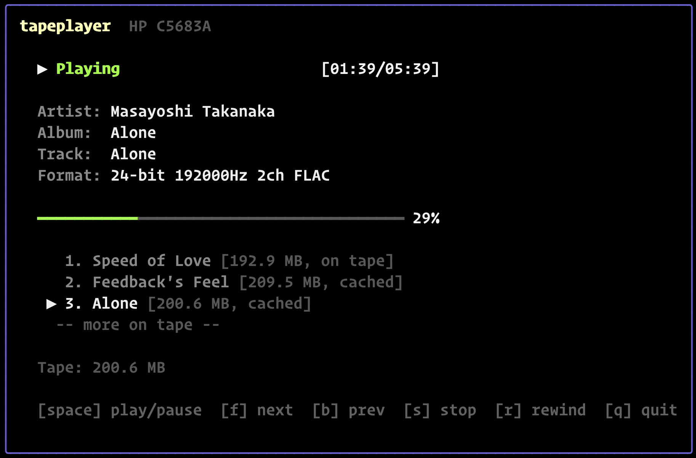

# tapeplayer

A TUI FLAC audio player for iSCSI-attached tape drives. Plays FLAC files directly from LTO, DDS, and other SCSI tape drives over iSCSI, with a tape deck-style terminal interface.

Built on [uiscsi](https://github.com/uiscsi/uiscsi) and [uiscsi-tape](https://github.com/uiscsi/uiscsi-tape).



## Features

- **Tape deck TUI** -- play/pause, stop, forward, back, rewind with bubbletea interface
- **Playlist discovery** -- builds a playlist as files are read from tape, showing track titles, sizes, and cache status
- **Streaming playback** -- starts playing before the full file is buffered from tape (critical for slower DDS drives)
- **LRU data cache** -- caches discovered tracks in memory (500MB default) for instant replay; metadata preserved even after eviction
- **FLAC metadata** -- displays artist, album, title, format from Vorbis comments
- **Variable and fixed block modes** -- works with any tape block size via `-bs`
- **Robust error handling** -- audio device errors, tape read errors, and FLAC decode errors are surfaced in the TUI with retry and skip options rather than crashing
- **Graceful shutdown** -- quit, Ctrl+C, double Ctrl+C force-quit, and audio device loss all cleanly close the tape drive and release resources before exit
- **streamBuffer lazy growth** -- memory is allocated as tape data arrives, not pre-allocated; a 50MB file on a DDS-4 drive uses only the memory read so far
- **Debug logging** -- `-debug` flag writes structured slog output to a file for diagnostics without polluting the TUI

## Tape Format

Standard UNIX tape layout -- each FLAC file is written as a continuous stream of tape records, separated by filemarks. Double filemark marks end of tape:

```
[FLAC 1][filemark][FLAC 2][filemark]...[FLAC N][filemark][filemark]
```

Write FLACs to tape with:
```sh
for f in *.flac; do
    dd if="$f" bs=524288 of=/dev/nst0
done
# Write double filemark (end of tape marker)
mt -f /dev/nst0 weof 2
```

## Usage

```sh
tapeplayer -portal 192.168.1.100:3260 -target iqn.example:tape -lun 2
```

### Options

| Flag | Default | Description |
|------|---------|-------------|
| `-portal` | (required) | iSCSI target portal (host:port) |
| `-target` | (required) | Target IQN |
| `-lun` | 0 | LUN number |
| `-initiator-name` | (auto) | Initiator IQN |
| `-bs` | 0 | Fixed block size in bytes (0 = variable block) |
| `-decompress` | false | Force enable hardware decompression |
| `-debug` | (none) | Debug log file path |

### Controls

| Key | Action |
|-----|--------|
| Space / Enter | Play / Pause |
| s | Stop |
| f / Right | Next track (from cache if available, else reads tape) |
| b / Left | Previous track (< 3s) or restart current (always from cache) |
| r | Rewind tape to beginning |
| q / Ctrl+C | Quit (second Ctrl+C force-quits) |

## Why This Works

Playing audio from tape over a network sounds impractical, but the math is comfortable. FLAC compresses audio to roughly 50-70% of PCM size. The resulting data rates are modest:

| Format | PCM bitrate | FLAC on tape | Tape headroom |
|--------|-------------|-------------|---------------|
| CD (16-bit, 44.1 kHz, stereo) | 1.4 Mbit/s | ~100-120 KB/s | DDS-4: 50x, LTO: 1000x |
| Hi-res (24-bit, 96 kHz, stereo) | 4.6 Mbit/s | ~300-400 KB/s | DDS-4: 15x, LTO: 300x |
| Hi-res (24-bit, 192 kHz, stereo) | 9.2 Mbit/s | ~600-800 KB/s | DDS-4: 8x, LTO: 150x |

Even the slowest tested drive (DDS-4 at ~6 MB/s) reads 8x faster than the highest-resolution FLAC needs. LTO drives are orders of magnitude faster. The tape always fills the buffer faster than the decoder drains it. Drives slower than ~1 MB/s (e.g. QIC, early DDS-1) may not sustain real-time playback of hi-res FLAC and are not supported.

The real challenges are mechanical, not bandwidth:

- **Startup latency.** The tape must physically spool to the read position. A streamBuffer lets playback begin from partially buffered data, so the user hears audio within seconds even on DDS.
- **Track skipping.** Tape is sequential. Forward skip reads through the current file to find the next filemark. Backward skip requires rewind. An LRU cache (500 MB default) makes replaying already-seen tracks instant.
- **iSCSI overhead.** Network RTT (~5 ms per SCSI command) is negligible at these data rates. A single 512 KB tape record takes ~85 ms to transfer on DDS-4 -- the 5 ms RTT is lost in the noise.

## Architecture

```
                          ┌──────────┐
                          │ Playlist │ (LRU cache + metadata)
                          └────┬─────┘
                               │
Tape Reader ──▶ streamBuffer ──┤──▶ FLAC Decoder ──▶ Ring Buffer ──▶ Audio Device
(goroutine)   (blocking reader)│    (goroutine)     (cond-var)     (malgo callback)
                               │
                               ▼
                          Bubbletea TUI
```

### Key components

- **Playlist**: central data structure tracking all discovered tape files. Each entry holds FLAC metadata (artist, title, duration, size) and optionally cached data. LRU eviction keeps memory under the configured limit (500MB default). The currently playing track is never evicted. Metadata survives eviction, so the playlist always shows the full track list.

- **streamBuffer**: growable buffer with blocking `io.Reader`. Memory is allocated on demand as tape data arrives -- there is no pre-allocation. Tape fills it in the background while the FLAC decoder reads from it concurrently. Enables playback to start before the full file is buffered -- critical for DDS drives (~6 MB/s) where a 50MB file takes ~8 seconds to buffer.

- **ringBuffer**: fixed-size PCM sample buffer between the FLAC decoder and the audio callback. Uses `sync.Cond` (no spin-waiting). The audio callback never blocks -- it fills silence on underrun.

- **Error recovery**: tape read errors, FLAC decode errors, and audio device errors are caught and delivered to the TUI as structured messages. The user is presented with retry and skip options. The player does not crash or silently skip on errors.

- **Clean shutdown**: a WaitGroup tracks all background goroutines (tape reader, FLAC decoder). Every exit path -- normal quit, Ctrl+C, double Ctrl+C force-quit, and audio device loss -- waits for goroutines to finish and closes the tape drive before the process exits. No goroutine or file descriptor leaks.

- **Navigation**: Forward/Back operate on the playlist index, not the tape head position. Cache hits are instant. If a track's data was evicted, the player rewinds the tape and re-reads (expensive, logged as warning).

## Dependencies

| Library | Purpose |
|---------|---------|
| [uiscsi](https://github.com/uiscsi/uiscsi) | iSCSI initiator |
| [uiscsi-tape](https://github.com/uiscsi/uiscsi-tape) | SSC tape driver |
| [mewkiz/flac](https://github.com/mewkiz/flac) | FLAC decoding (pure Go) |
| [gen2brain/malgo](https://github.com/gen2brain/malgo) | Audio output (miniaudio) |
| [charmbracelet/bubbletea](https://github.com/charmbracelet/bubbletea) | TUI framework |
| [charmbracelet/lipgloss](https://github.com/charmbracelet/lipgloss) | TUI styling |

## Requirements

- Go 1.25 or later
- CGo (required by malgo for system audio)
- iSCSI-attached tape drive with loaded media
- Tests require [goleak](https://github.com/uber-go/goleak) for goroutine leak detection (test-only)
